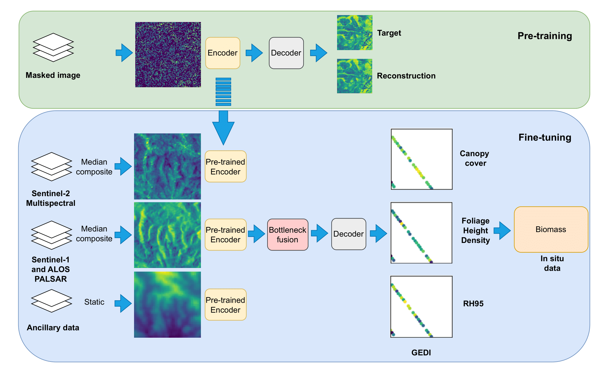
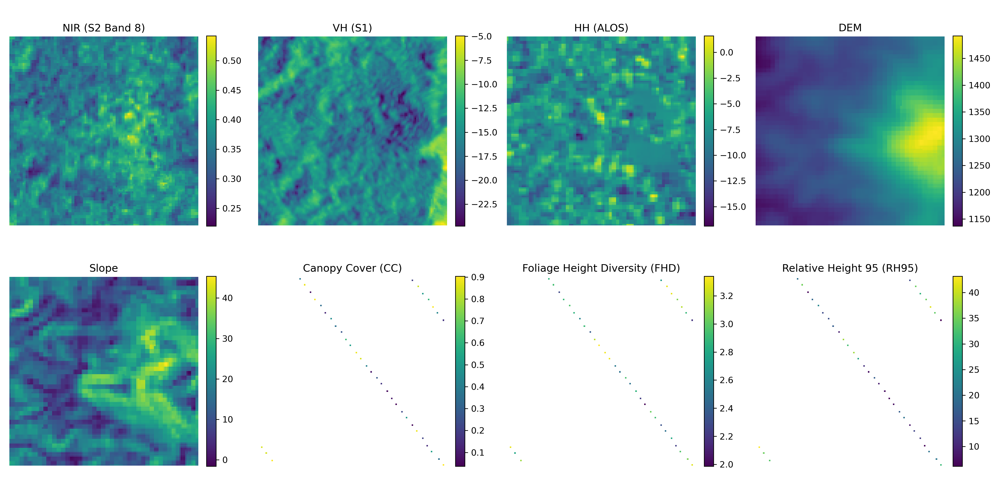

# GEDI structure prediction

Estimate canopy cover (CC), foliage height diversity (FHD), and RH95 from
Sentinel-2, Sentinel-1, ALOS, DEM, and slope tiles using masked-autoencoder
pretraining and a multi-sensor UNet.



## Installation

Python 3.11 and 3.12 are supported. Install [uv](https://docs.astral.sh/uv/getting-started/installation/), then from a fresh checkout:

```sh
uv sync --locked --extra cpu
uv run --locked --extra cpu gedi-pretrain --help
uv run --locked --extra cpu gedi-finetune --help
```

`pyproject.toml` defines the package and dependencies; `uv.lock` records the
resolved versions. Keep `--extra cpu` on subsequent `uv run` commands to retain
the CPU environment. Development tools are installed by default; add `--no-dev`
for training-only environments. Notebook tools are optional:

```sh
uv sync --locked --extra cpu --extra notebooks
```

For NVIDIA GPU training, `uv sync --locked` selects the default PyPI PyTorch
build instead of the CPU index. Verify driver compatibility and CUDA availability
before a long run with `uv run --locked python -c "import torch; print(torch.cuda.is_available())"`.
See [uv's PyTorch guide](https://docs.astral.sh/uv/guides/integration/pytorch/)
for other accelerator builds. GPU execution is not covered by CI.

The lock constrains stringzilla to a release with Windows wheels, avoiding a
C++ compiler requirement in the augmentation dependency chain. Plain pip users
can install the package with `pip install .`; uv is the tested, locked workflow.

## Data contract

Each input `X_<id>.npy` must have a matching `y_<id>.npy` in the same directory.
Arrays use channel-first layout:

- Inputs: `(28, H, W)`: 20 Sentinel-2/metadata channels, six Sentinel-1/ALOS
  channels, then DEM and slope. Exact channel names are in `data_loader.bands_x`.
- Targets: `(3, H, W)`, ordered **CC, FHD, RH95**.
- Spatial dimensions must match and be positive multiples of eight.
- Missing targets may be NaN. Losses exclude non-finite targets and fail clearly
  if a task has no valid targets or predictions are non-finite at valid targets.
- Fine-tuning replaces missing input values with zero after normalization;
  pretraining masks missing inputs.

At least ten paired tiles are required for the seeded 80/10/10 train/validation/test
split (rounded for indivisible counts). Training alone uses augmentation and
shuffling. The test split is reserved; training does not report held-out accuracy.
Random tile splitting is a software default: use a spatially independent evaluation
design when assessing geographic generalization.

Normalization is optional. `--scaling-file` accepts a **trusted** legacy pickle
containing `(means, stds, mean_y, std_y)`, with 28 input and three target statistics.
Standard deviations must be finite and positive. Fit scalers on training data only.
Omitting the scaler trains on raw values.

## Training

```sh
uv run --locked --extra cpu gedi-pretrain --sensor-train s2 --data-dir data/processed --scaling-file experiments/weights/scaler.pickle --output-dir experiments/runs/s2
uv run --locked --extra cpu gedi-pretrain --sensor-train s1 --data-dir data/processed --scaling-file experiments/weights/scaler.pickle --output-dir experiments/runs/s1
uv run --locked --extra cpu gedi-finetune --data-dir data/processed --scaling-file experiments/weights/scaler.pickle --s2-file experiments/weights/s2-pretrain-epoch=98-val_loss=0.05282.ckpt --s1-file experiments/weights/s1alos-pretrain-epoch=98-val_loss=0.06877.ckpt
```

Supply both encoder checkpoints to fine-tune; omit both to train from scratch.
Pretrained encoders remain frozen until `--unfreeze-epoch` (default 10).
Checkpoint parameter names and default architecture are retained for existing weights.
New checkpoints store constructor settings for Lightning checkpoint loading.

Both commands accept `--batch-size`, `--num-workers` (default 0 for portability),
`--seed`, `--max-epochs`, `--accelerator`, `--lr`, `--lr-decay`, and `--weight-decay`.
Paths are relative to the working directory, or may be absolute. Lightning saves
logs and best-validation checkpoints beneath `--output-dir`.

For a quick data/environment check, append `--accelerator cpu --fast-dev-run`.
This executes one training and validation batch without saving checkpoints.
Seeded runs are repeatable on a fixed environment; identical GPU results across
hardware and worker configurations are not guaranteed. MAE validation still draws
random reconstruction masks; geometric/intensity augmentation is training-only.

## Development and verification

```sh
uv sync --locked --extra cpu
uv run --locked --extra cpu ruff check
uv run --locked --extra cpu ruff format --check
uv run --locked --extra cpu pytest --cov --cov-report=term-missing --cov-report=xml
uv build
```

Tests generate small synthetic tiles and require neither real datasets nor pretrained
weights. They check channel selection, normalization, missing values, deterministic
splits, argument forwarding, model gradients and parameter updates, encoder freezing,
and checkpoint round trips. Coverage must reach 80%.

GitHub Actions runs formatting/lint checks and the test suite on Linux (3.11/3.12)
and Windows (3.11). Linux jobs also build the source distribution and wheel, replace
the editable installation with the wheel, and verify imports and CLI commands outside
the checkout. CI uses a fixed uv version and commit-pinned actions.

To update dependencies deliberately, run `uv lock --upgrade`, sync, and run the checks
above before committing `uv.lock`. The workflow validates build artifacts; publishing
releases and configuring GitHub branch protection remain repository-owner settings.

## Repository layout

- `src/gedi_structure_prediction/`: installable package, training commands and models.
- `tests/`: automated synthetic CPU tests.
- `.github/workflows/ci.yml`: continuous integration.
- `notebooks/`: exploratory analysis (install the notebook extra).
- `data/processed/`, `experiments/weights/`: example data and legacy artifacts; excluded from distributions.

Imports now use `gedi_structure_prediction`, replacing `src` imports. Use the installed
commands or `python -m gedi_structure_prediction.pretrain` / `python -m gedi_structure_prediction.train_finetuning`
instead of executing files within `src` directly.



## License and acknowledgements

MIT; see [LICENSE](LICENSE). Thanks to GEDI and satellite data providers and PyTorch
Lightning. UNet building blocks retain the source attribution in `model/mae.py`.
